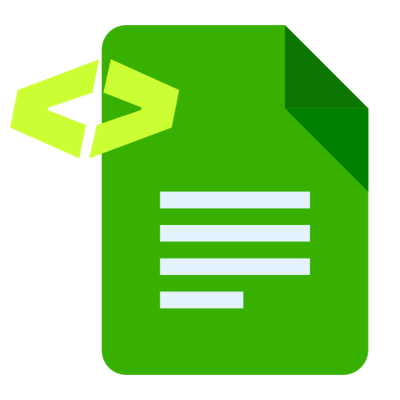

<p align="center">
  
</p>

<h1 align="center">DocuWriter.ai MCP Server</h1>

<p align="center">
  Connect your AI tools to <a href="https://www.docuwriter.ai">DocuWriter.ai</a> — generate, search, and manage codebase documentation without leaving your editor.
</p>

---

This is the official **remote MCP server** for [DocuWriter.ai](https://www.docuwriter.ai). It is hosted — there is nothing to clone, build, or run locally. You point your MCP-compatible client at the server URL, authenticate once with your DocuWriter.ai account, and its tools become available to your AI assistant.

- **Endpoint:** `https://app.docuwriter.ai/mcp`
- **Transport:** Streamable HTTP
- **Auth:** OAuth 2.1 (handled automatically by your client on first connect)
- **Registry:** [`ai.docuwriter/docuwriter`](https://registry.modelcontextprotocol.io/v0/servers?search=docuwriter) in the official MCP Registry

A [DocuWriter.ai account](https://www.docuwriter.ai) is required (free trial available).

## What you can do

The server exposes 72 tools covering the DocuWriter.ai platform:

- **Generate documentation** from source code — code docs, README files, UML diagrams, Swagger/OpenAPI specs, code comments, tests, and language conversion.
- **Full documentation trees** — generate and manage complete documentation trees for an imported repository.
- **Semantic search** over your docs and spaces.
- **Autopilot** — review, apply, snooze, or discard the documentation suggestions Autopilot generates on repository changes.
- **Spaces & documents** — create, update, move, copy, and export spaces, documents, folders, and share links.
- **Repositories** — manage provider connections (GitHub, GitLab, Bitbucket, Azure) and Autopilot repository links.
- **Teams & webhooks** — manage teammates, invitations, roles, and webhook subscriptions.

## Connect your client

### Claude Code

```bash
claude mcp add --transport http docuwriter https://app.docuwriter.ai/mcp
```

### Cursor

Add to `~/.cursor/mcp.json` (global) or `.cursor/mcp.json` (project):

```json
{
  "mcpServers": {
    "docuwriter": {
      "url": "https://app.docuwriter.ai/mcp"
    }
  }
}
```

### VS Code

Add to `.vscode/mcp.json`:

```json
{
  "servers": {
    "docuwriter": {
      "type": "http",
      "url": "https://app.docuwriter.ai/mcp"
    }
  }
}
```

### Claude Desktop

Settings → **Connectors** → **Add custom connector** → enter the URL `https://app.docuwriter.ai/mcp`.

### Cline

See [`llms-install.md`](./llms-install.md) — Cline can configure this server automatically.

## Authentication

On first connect, your client opens a browser window to sign in to DocuWriter.ai and authorize access (OAuth 2.1). No API keys to copy or store. Tokens are managed by your client.

## Links

- Website — https://www.docuwriter.ai
- Documentation — https://docs.docuwriter.ai
- Support — support@docuwriter.ai
- Privacy — https://app.docuwriter.ai/privacy-policy

## License

The contents of this repository (documentation and connection metadata) are released under the [MIT License](./LICENSE). The DocuWriter.ai service and MCP server itself are proprietary and operated by DocuWriter.ai.
